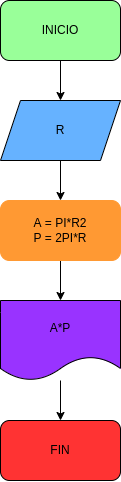

# ejrcicio No. 1 

## calcular el area  y el perimtro de radio R. 

Variable de entrada (imput) 

R:radio del circulo 

variable del proceso y salida (pocessimd, storang, outout)

A: area del circulo 
P: perimetro del circulo 

# Diseño

# CONSTRUCCIN 

## Este archivo esta escrito en lenguaje Markdown 
